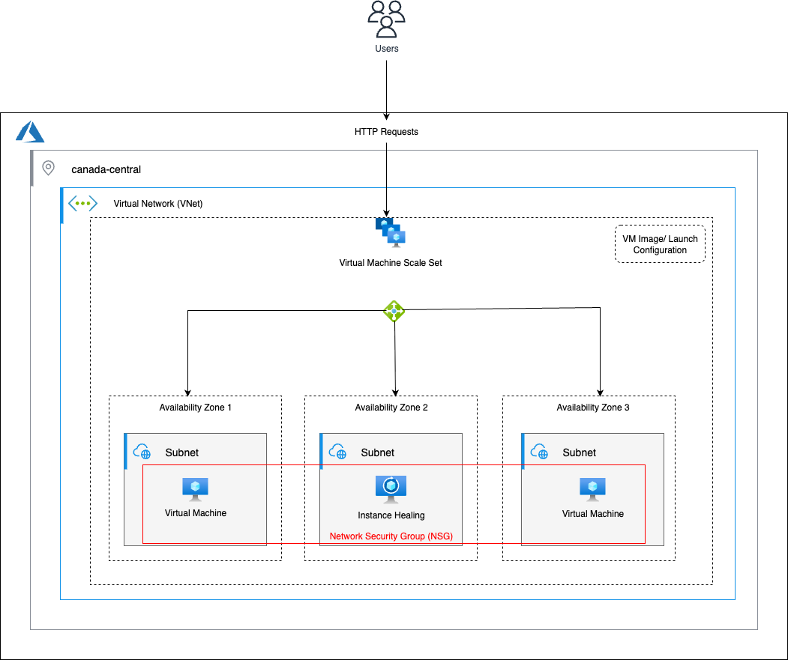

# Lab 4 – Understanding Virtual Machine Scale Sets (VMSS) in Azure

## Overview

In this lab, we’ll explore **Azure Virtual Machine Scale Sets (VMSS)** — the Azure equivalent of AWS Auto Scaling Groups (ASG).  
You’ll learn how to **automatically scale virtual machines** based on performance metrics such as CPU usage, while maintaining high availability and fault tolerance.

By the end of this lab, you’ll understand how to:

- Create and configure a **VM Scale Set** using the Azure Portal (or CLI).
- Deploy a sample web app across multiple VM instances.
- Set up **manual** and **automatic scaling rules**.
- Observe how Azure automatically **scales out** and **scales in** your instances based on load.

---

## Technologies Used

- **Azure Virtual Machine Scale Sets (VMSS)**
- **Azure Virtual Network (VNet)**
- **Azure Load Balancer**
- **Azure Monitor / Autoscale Settings**
- **Azure Portal / CLI**

---

## Learning Objectives

1. Understand how Virtual Machine Scale Sets (VMSS) simplify the deployment and management of multiple identical VMs.
2. Learn how to configure a **custom image** or **standard image** for scale set instances.
3. Implement **autoscaling rules** based on metrics (e.g., CPU utilization).
4. Verify scale-in and scale-out behavior dynamically.

---

## Architecture Diagram

The diagram below illustrates a simple deployment of a **Virtual Machine Scale Set** behind a Load Balancer.

Traffic is distributed evenly, and autoscale rules adjust the number of instances based on demand.



---

<!-- ## Lab Tasks -->

<!-- ### **Task 1 – Introduction**

Get familiar with the lab objectives and the concept of VM Scale Sets in Azure.

---

### **Task 2 – Create Virtual Machine and Custom Image**

1. Launch a standard **Virtual Machine** (e.g., Ubuntu 22.04 LTS).
2. Install and start a **Node.js web server** that displays the instance’s private IP address.
3. Capture a **custom image** from this VM to be used by the Scale Set.

---

### **Task 3 – Create and Configure the Virtual Machine Scale Set**

1. Create a new **VM Scale Set** using the custom image or a standard marketplace image.
2. Attach it to an existing or new **Virtual Network** and **Load Balancer**.
3. Configure:
   - Initial instance count (e.g., 2)
   - Instance size (e.g., Standard_B1s)
   - Scaling policy (manual or automatic)

---

### **Task 4 – Define Autoscale Rules**

1. Open **Azure Monitor → Autoscale Settings** for your VM Scale Set.
2. Add rules such as:
   - **Scale Out**: Add 1 instance if average CPU > 70% for 5 minutes.
   - **Scale In**: Remove 1 instance if average CPU < 30% for 5 minutes.
3. Save and apply the configuration.

---

### **Task 5 – Test Scaling Behavior**

1. Use a **load testing tool** (e.g., Apache Benchmark or `hey`) to simulate high CPU load on the instances.
2. Monitor scaling activity under:
   - **Azure Portal → VMSS → Instances**
   - **Azure Monitor → Autoscale logs**
3. Observe automatic scale-out when CPU increases and scale-in when idle.

---

### **Task 6 – Clean Up**

To avoid unnecessary costs, delete:

- The **Scale Set**
- The **Load Balancer**
- Any associated **resource groups** or **storage resources** -->

<details>
<summary><b>1️⃣ Getting Started</b></summary>

Azure **Virtual Machine Scale Sets (VMSS)** is a service that lets you deploy and manage a group of identical, load-balanced virtual machines.  
It automatically scales the number of VM instances according to demand or based on rules you define.

A Scale Set includes:

- A **VM configuration model** (similar to a launch template in AWS) that defines the OS image, VM size, storage, and networking.
- **Autoscale rules** that control when new VMs are added or removed.
- A **Network Security Group (NSG)** that defines allowed inbound and outbound traffic (similar to an EC2 Security Group).

> 💡 Azure Monitor tracks metrics such as **CPU utilization**, and triggers the scaling logic automatically.

### Lab Guidelines

- Ensure you’re working in the **East US** region (or your assigned Azure region).  
  On the Azure Portal top bar, check the region selector beside your profile.
- Some features may show limited permissions depending on your sandbox subscription.  
  You can safely ignore “insufficient privilege” warnings during this lab.

</details>

---

<details>
<summary><b>2️⃣ Create a Virtual Machine</b></summary>

In this task, we’ll create a base virtual machine that runs a **Node.js web app**.  
Later, we’ll capture this VM as an image and use it as the base configuration for our scale set.

### Steps

1. In the Azure Portal search bar, type **Virtual Machines** and select **+ Create → Azure Virtual Machine**.
2. Configure the VM:
   - **Resource Group:** `vmss-lab-rg`
   - **Virtual Machine name:** `vmss-base-vm`
   - **Region:** East US
   - **Image:** Ubuntu 22.04 LTS
   - **Size:** Standard B1s
   - **Username:** `azureuser`
   - **Password:** create a secure one
   - **Public inbound ports:** Allow SSH (22) and HTTP (3000)
3. Under **Networking**, a new **Network Security Group (NSG)** will be created automatically.  
   Add one inbound rule:
   - **Port:** 3000
   - **Protocol:** TCP
   - **Source:** Any
   - **Description:** Allow HTTP access for Node app
4. Click **Review + Create → Create** and wait for the deployment to finish.

### Connect and Install Node.js

```bash
ssh azureuser@<public-ip>
sudo apt update
sudo apt install -y curl
curl -fsSL https://deb.nodesource.com/setup_16.x | sudo -E bash -
sudo apt install -y nodejs
```

### Create a simple Node app:

```bash
mkdir eduapp && cd eduapp
npm install express ip
cat > index.js <<EOF
const express = require('express');
const ip = require('ip');
const app = express();
const PORT = process.env.PORT || 3000;
app.get('/', (req,res)=>res.send(ip.address()));
app.listen(PORT, ()=>console.log('Server listening at port 3000'));
EOF

node index.js
```

Visit `http://<public-ip>:3000` to see the **private IP address** displayed.

</details>

---

<details>
<summary><b>3️⃣ Create a Custom Image (Equivalent of Launch Template)</b></summary>

Now that our Node app runs successfully, we’ll capture this VM as a reusable image.  
This image acts as the “Launch Template” for our Scale Set.

### Steps

1. Go to **Virtual Machines → vmss-base-vm**.
2. Stop (deallocate) the VM.
3. On the VM overview page, click **Capture**.
4. Set:
   - **Image name:** `vmss-node-image`
   - **Resource group:** `vmss-lab-rg`
   - Check **Automatically delete this VM after creating the image**.
5. Click **Review + Create → Create**.  
   Once complete, you’ll see the new image under **Images**.

</details>

---

<details>
<summary><b>4️⃣ Create a Virtual Machine Scale Set (Equivalent of Auto Scaling Group)</b></summary>

Now, we’ll create a **Virtual Machine Scale Set (VMSS)** using our captured image.

### Steps

1. In the Azure Portal search bar, type **Virtual Machine Scale Sets**, then click **+ Create**.
2. Configure:
   - **Resource group:** `vmss-lab-rg`
   - **Scale Set name:** `my-vmss`
   - **Region:** East US
   - **Image:** select **My Images → vmss-node-image**
   - **Size:** Standard B1s
   - **Authentication type:** Password or SSH
   - **Instance count:** 1 (initially)
3. Under **Networking**, use the same **Virtual Network** and **Subnet** created earlier.  
   Keep the **Load Balancer** option enabled (it will distribute traffic among instances).
4. Under **Scaling**, define:
   - **Minimum VMs:** 1
   - **Maximum VMs:** 2
   - **Initial (Desired) count:** 1
   - **Scaling policy:** **Custom autoscale**
   - **Metric:** **Average CPU percentage**
   - **Scale out rule:** Add 1 VM when CPU > 70% for 5 minutes
   - **Scale in rule:** Remove 1 VM when CPU < 30% for 10 minutes
5. Click **Review + Create → Create**.

</details>

---

<details>
<summary><b>5️⃣ Verifying and Testing VMSS Behavior</b></summary>

We’ll now test how our VMSS behaves when:

1. A VM instance fails or is deleted.
2. CPU utilization exceeds the defined threshold.

### Case 1 – Instance Failure

1. In **Virtual Machine Scale Sets → Instances**, select an instance and click **Delete**.
2. Wait a few minutes — VMSS automatically detects the loss and replaces it with a new healthy VM.  
   You can verify this under the **Instances** tab or **Activity Log**.

### Case 2 – High CPU Load

```bash
sudo apt install -y stress
sudo stress --cpu 4 --timeout 320
```

1. Go to **VMSS → Scaling → Metrics** and watch the **CPU %** graph spike.
2. When CPU exceeds 70 %, Azure adds a new instance automatically.
3. When load drops below 30 %, the extra instance is removed after the cooldown period.

</details>

---

<details>
<summary><b>6️⃣ Clean Up</b></summary>

After completing the lab, remove all resources to avoid charges.

1. Delete the **Virtual Machine Scale Set** (`my-vmss`).
2. Delete the **Custom Image** (`vmss-node-image`).
3. Delete the **Network Security Group** and **Load Balancer** created automatically.
4. Finally, delete the **Resource Group (`vmss-lab-rg`)** to remove everything in one go.

## </details>

## Summary

In this lab, you learned how to:

- Create and configure Azure Virtual Machine Scale Sets (VMSS)
- Define scaling rules using Azure Monitor metrics
- Observe automatic scaling in action

This approach ensures that your application can handle changing workloads efficiently — **scaling automatically without manual intervention.**
